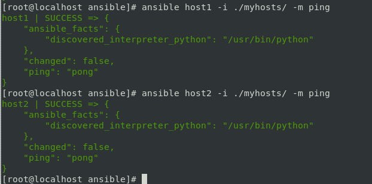
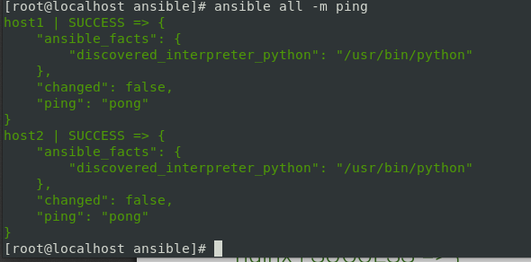

# **Домашнее задание №10: Автоматизация администрирования. Ansible.**


## **Задание:**

Подготовить стенд на Vagrant как минимум с одним сервером. На этом сервере используя Ansible необходимо развернуть nginx со следующими условиями:
- необходимо использовать модуль yum/apt
- конфигурационные файлы должны быть взяты из шаблона jinja2 с перемененными
- после установки nginx должен быть в режиме enabled в systemd
- должен быть использован notify для старта nginx после установки
- сайт должен слушать на нестандартном порту - 8080, для этого использовать переменные в Ansible

##**Выолнено:**

- Создаем каталог Ansible и копируем в него [Vagrantfile](./Vagrantfile)

- Поднимаем управляемые хосты командой **vagrant up** и убеждаемся, что все прошло успешно и есть доступ по **ssh**

- Для подключения к хостам нам необходимо будет передать множество параметров - это особенность Vagrant. Узнать эти параметры можно с помощью команды **vagrant ssh-config**

- Используя эти параметры создадим свой первый [inventory](./myhosts/vagrant-hosts) файл и убедимся, что Ansible может управлять нашим хостом:





- В текущем каталоге создадим файл [ansible.cfg](./ansible.cfg) для того, чтобы каждый раз явно не указывать наш инвентори файл. После чего можно убрать информацию о пользователе из инвентори.
- Еще раз убедимся, что управляемые хосты доступны, только теперь без явного указания inventory файла:





- Установим пакет epel-release на наши хосты:

```
ansible all -m yum -a "name=epel-release state=present" -b
```
- Создадим [Playbook](./playbooks/nginx.yml) для установки NGINX на наши хосты, в котором пропишем необходимую нам переменную, чтобы NGINX слушал на порту 8080, а также модуль, который будет копировать шаблон [nginx.conf.j2](./nginx.conf.j2) на хост. Cоздадим **handler** и добавим **notify** к копированию шаблона для того, чтобы каждый раз, когда конфиг будет изменяться - сервис перезагружался.
- Запускаем получившийся [Playbook](./playbooks/nginx.yml):


- Проверяем доступность:

```
curl http://192.168.11.150:8080
curl http://192.168.11.151:8080
```
