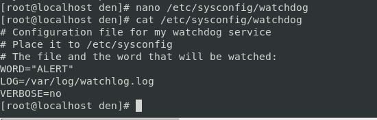
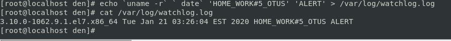
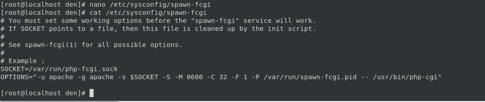
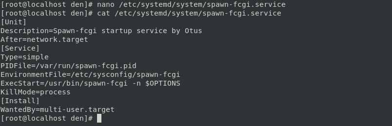
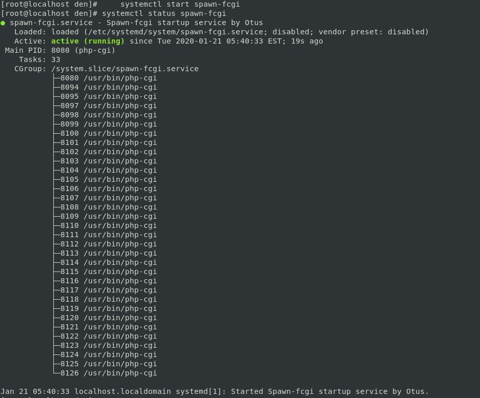
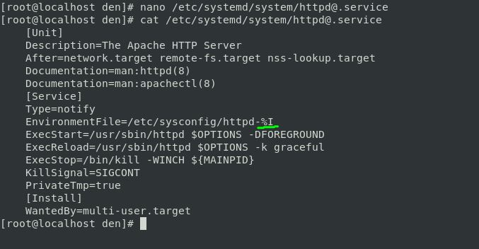
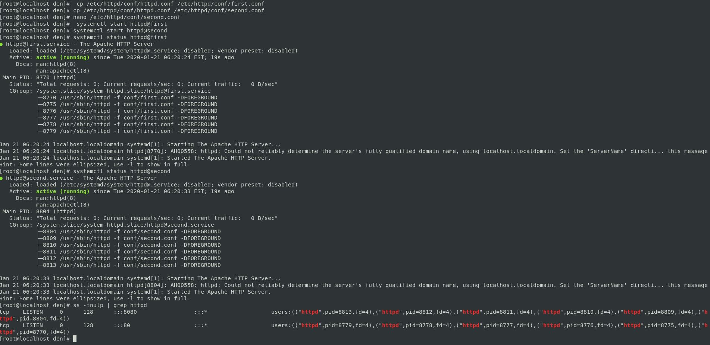

# **Домашнее задание №5: Инициализация системы. Systemd и SysV**

## **Задание:**

- **Написать сервис, который будет раз в 30 секунд мониторить лог на предмет наличия ключевого слова. Файл и слово должны задаваться в /etc/sysconfig**
- **Из epel установить spawn-fcgi и переписать init-скрипт на unit-файл. Имя сервиса должно так же называться**
- **Дополнить юнит-файл apache httpd возможностьб запустить несколько инстансов сервера с разными конфигами**


## **Ход выполнения:**

- **Написать сервис, который будет раз в 30 секунд мониторить лог на предмет наличия ключевого слова. Файл и слово должны задаваться в /etc/sysconfig**

    # Создадим файл с конфигурацией для сервиса в директории /etc/sysconfig - из неё сервис будет брать необходимые переменные 
    
    
    
    # Создадим /var/log/watchlog.log с произвольным содержимым + ключевое слово ‘ALERT’
   
   
   
    # Создадим скрипт 
    [/opt/watchlog.sh](./scripts/watchlog.sh)
   
   *Команда logger отправляет лог в системный журнал
   
   # Создадим юнит для сервиса 
   [/etc/systemd/system/watchlog.service](./scripts/watchlog.service)
   
   # Создадим юнит для таймера [/etc/systemd/system/watchlog.timer](./scripts/watchlog.timer)
   
   # Стартуем сервис, запускаем таймер и убеждаемся в результате:
   
   
   
   

-  **Из epel установить spawn-fcgi и переписать init-скрипт на unit-файл. Имя сервиса должно так же называться**
    
    # Устанавливаем spawn-fcgi и необходимые для него пакеты:
    ```
    yum install epel-release -y && yum install spawn-fcgi php php-cli mod_fcgid httpd -y
    ```
    # Раскомментируем строки с переменными в /etc/sysconfig/spawn-fcgi
    
    
    
    # Создадим init файл /etc/systemd/system/spawn-fcgi.service
    
    
    # Убеждаемся, что все успешно работает:
    
    
  
                                                                                         
- **Дополнить юнит-файл apache httpd возможностью запустить несколько инстансов сервера с разными конфигами**
    
    # Для запуска нескольких экземпляров сервиса будем использовать шаблон httpd@ в конфигурации файла окружения:
  
  
  # Создадим два файла окружения в /etc/sysconfig, в которых задаются опции для запуска веб-сервера с необходимыми конфигурационными файлами:
    ```
    # /etc/sysconfig/httpd-first
    OPTIONS=-f conf/first.conf
    # /etc/sysconfig/httpd-second
    OPTIONS=-f conf/second.conf
    ```
 # Создадим два файла конфигурации в директории /etc/httpd/conf:

    ```
    cp /etc/httpd/conf/httpd.conf /etc/httpd/conf/first.conf
    cp /etc/httpd/conf/httpd.conf /etc/httpd/conf/second.conf
    ```
 # Отредактируем файл конфигурации *second.conf* для исключения пересечения по портам и PidFiles.
    ```
    PidFile /var/run/httpd-second.pid
    Listen 8080
    ```
*Для удачного запуска, в конфигурационных файлах должны быть указаны уникальные для каждого экземпляра опции Listen и PidFile.
    
 # Запускаем и проверяем:
                                                                                                                                                                             
