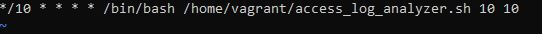

# **Домашнее задание №6: Bash, awk, sed, grep и другие .**

## **Задание:**
**Написать скрипт для крона, который раз в час присылает на заданную почту:**
- **X IP адресов (с наибольшим кол-вом запросов) с указанием кол-ва запросов c момента последнего запуска скрипта**
- **Y запрашиваемых адресов (с наибольшим кол-вом запросов) с указанием кол-ва запросов c момента последнего запуска скрипта**
- **все ошибки c момента последнего запуска**
- **список всех кодов возврата с указанием их кол-ва с момента последнего запуска**

*в письме должен быть прописан обрабатываемый временной диапазон, а также должна быть реализована защита от мультизапуска*

## **Описание прилагаемых к ДЗ файлов:**

[access_log_analyzer.sh](./access_log_analyzer.sh) - основной скрипт, выполняющий анализ содержимого файла журнала [access.log](./access.log)

[access.log](./access.log) - основной файл журнала

[Vagrantfile](./Vagrantfile) - Vagrant файл для тестирования скрипта

[crontabnew](./crontabnew)- файл для создания расписания запуска скрипта

## **Запуск и результат выполнения скрипта:**

Для запуска и выполнения скрипта необходимо запустить ВМ, используя [Vagrantfile](./Vagrantfile). Для тестирования скрипт запускается каждые 10 минут, что прописано в [crontabnew](./crontabnew) (при необходимости можно задать любой интервал запуска скрипта):

*Параметры 10 10 в конце строки указывают на заданное пользователем количество X IP адресов (с наибольшим кол-вом запросов) и Y запрашиваемых адресов (с наибольшим кол-вом запросов).*

Результат работы скрипта:

