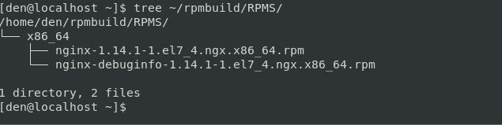
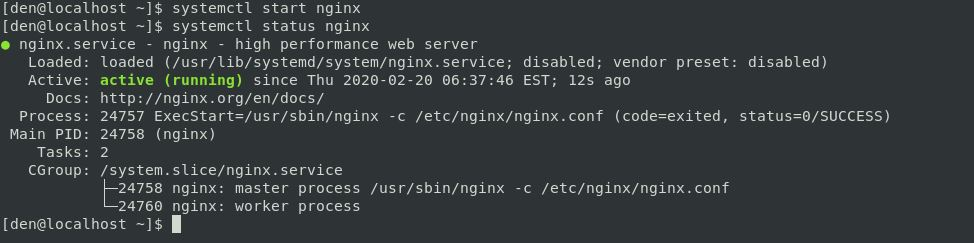
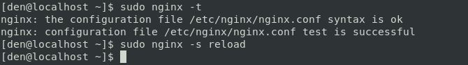
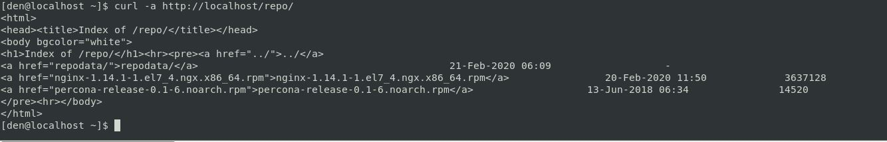
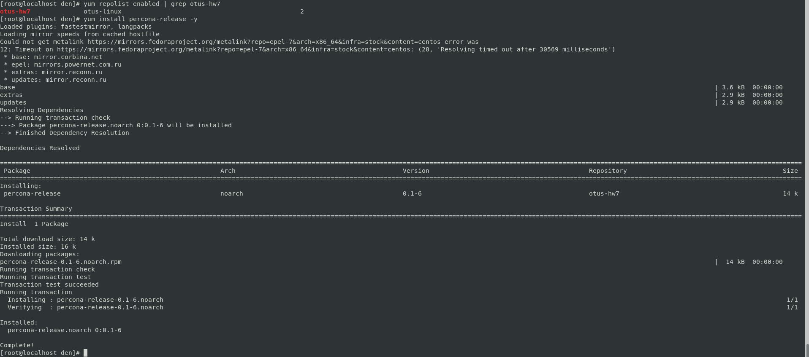

# **Домашнее задание №7: Управление пакетами. Дистрибьюция софта.**

## **Задание:**
**Размещаем свой RPM в своем репозитории**
- **создать свой RPM (можно взять свое приложение, либо собрать к примеру апач с определенными опциями)**
- **создать свой репо и разместить там свой RPM**
*реализовать это все либо в вагранте, либо развернуть у себя через nginx и дать ссылку на репо*


## **Ход выполнения:**

### Создаем свой RPM пакет (возьмем пакет NGINX и соберем его с поддержкой openssl)

#### Устанавливаем необходимые пакеты:

```
yum install -y \
redhat-lsb-core \
wget \
rpmdevtools \
rpm-build \
createrepo \
yum-utils \
gcc
```

#### Загружаем SRPM пакет NGINX:

```
wget https://nginx.org/packages/centos/7/SRPMS/nginx-1.14.1-1.el7_4.ngx.src.rpm
```
#### Установливаем SRC пакет (при установке такого пакета в домашней директории создается древо каталогов для сборки):

```
rpm -i nginx-1.14.1-1.el7_4.ngx.src.rpm
```


#### Скачиваем и разархивируем последний исходник для openssl:

```
wget https://www.openssl.org/source/openssl-1.1.1d.tar.gz
tar -xvf openssl-1.1.1d.tar.gz
```

#### Cтавим все зависимости чтобы в процессе сборки не было ошибок:

```
yum-builddep rpmbuild/SPECS/nginx.spec
```

#### Правим [spec](./files/nginx.spec) файл чтобы NGINX собирался с необходимыми нам опциями:

```
--with-openssl=/home/den/openssl-1.1.1d
```

[Cсылка](https://nginx.org/ru/docs/configure.html), где можно посмотреть все доступные опции для сборки nginx.

#### Запускаем процесс сборки самого пакета:

```
rpmbuild -bb rpmbuild/SPECS/nginx.spec
```

#### Проверяем результаты сборки:


    
    

#### Устанавливаем nginx из ранее собранного rpm и убеждаемся, что он работает:

```
yum localinstall -y rpmbuild/RPMS/x86_64/nginx-1.14.1-1.el7_4.ngx.x86_64.rpm
```



### **Создать свой репозиторий и разместить там ранее собранный RPM** 

####  Приступим к созданию своего репозитория (директория для статики у NGINX по умолчанию /usr/share/nginx/html). Создадим там каталог repo и скопируем туда наш собранный RPM и, например, RPM для установки репозитория Percona-Server:

```
mkdir /usr/share/nginx/html/repo
cp rpmbuild/RPMS/x86_64/nginx-1.14.1-1.el7_4.ngx.x86_64.rpm /usr/share/nginx/html/repo/
wget http://www.percona.com/downloads/percona-release/redhat/0.1-6/percona-release-0.1-6.noarch.rpm \
-O /usr/share/nginx/html/repo/percona-release-0.1-6.noarch.rpm
```
#### Инициализируем репозиторий командой:

```
createrepo /usr/share/nginx/html/repo/
```


#### Для прозрачности настроим в NGINX доступ к листингу каталога:

*В location / в файле [/etc/nginx/conf.d/default.conf](./files/default.conf) добавим директиву **autoindex on**.
В результате location будет выглядеть так:*


```
location / {
root /usr/share/nginx/html;
index index.html index.htm;
autoindex on;
}
```

#### Проверяем синтаксис и перезапускаем NGINX:

```
nginx -t
nginx -s reload
```


#### Проверяем работу репозитория:



#### Добавляем его в перечень локальных репозиториев и проверяем:**

```
cat >> /etc/yum.repos.d/otus-hw7.repo << EOF
[otus-hw7]
name=otus-linux
baseurl=http://localhost/repo
gpgcheck=0
enabled=1
EOF
```

```
[root@localhost den]# yum repolist enabled | grep otus-hw7
otus-hw7              otus-linux                                               2
[root@localhost den]# yum list | grep otus-hw7
nginx.x86_64                                1:1.14.1-1.el7_4.ngx       otus-hw7
percona-release.noarch                      0.1-6                      otus-hw7
```

#### Ставим percona-release из локального репозитория:


