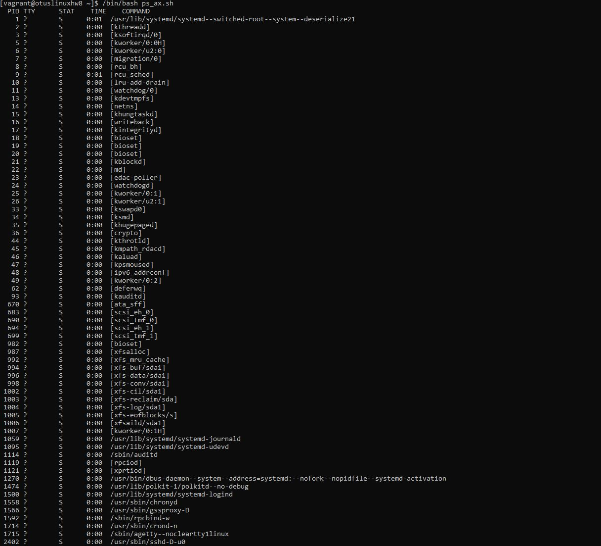
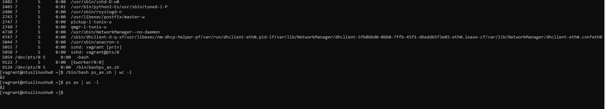

# **Домашнее задание №8: Управление процессами.**

## **Задание:**
**Написать свою реализацию ps ax используя анализ /proc**

*Результат ДЗ - рабочий скрипт, который можно запустить*

## **Запуск и результат выполнения скрипта [ps_ax.sh](./ps_ax.sh):**

