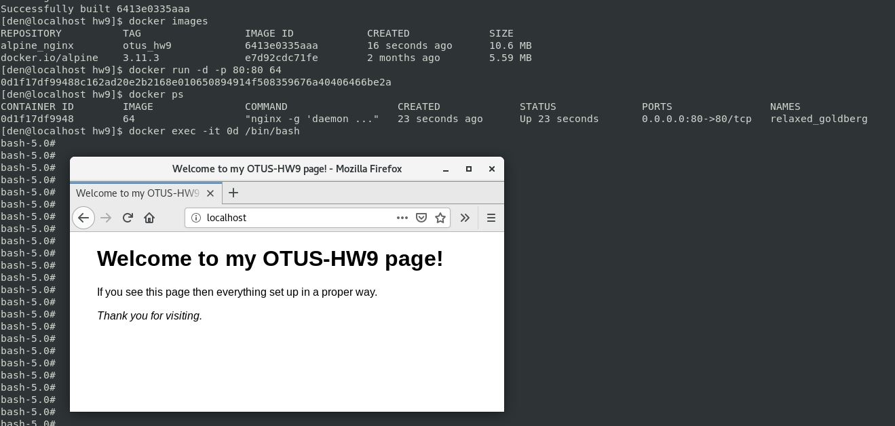

# **Домашнее задание №9: Docker.**

## **Цель:**

Разобраться с основами docker, с образа, эко системой docker в целом.

## **Задание:**

- Создайте свой кастомный образ nginx на базе alpine. После запуска nginx должен отдавать кастомную страницу (достаточно изменить дефолтную страницу nginx) 
- Определите разницу между контейнером и образом. Вывод опишите в домашнем задании.
- Ответьте на вопрос: Можно ли в контейнере собрать ядро?
- Собранный образ необходимо запушить в docker hub и дать ссылку на ваш репозиторий.


## **Выполнено:**

### **Создайте свой кастомный образ nginx на базе alpine. После запуска nginx должен отдавать кастомную страницу**

Создан [Dockerfile](./Dockerfile) на базе **alpine** c кастомными настройками и кастомной стартовой страничкой nginx. 
Образ, собранный из [Dockerfile](./Dockerfile) выложен на DockerHub: [ddeuterium/nginx](https://hub.docker.com/repository/docker/ddeuterium/nginx) 

Запускаем:

```
docker run -d -p 80:80 ddeuterium/nginx
```




