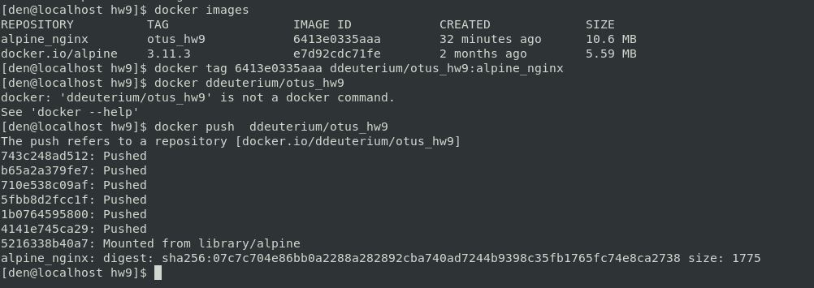

# **Домашнее задание №9: Docker.**

## **Цель:**

Разобраться с основами docker, с образа, эко системой docker в целом.

## **Задание:**

- Создайте свой кастомный образ nginx на базе alpine. После запуска nginx должен отдавать кастомную страницу (достаточно изменить дефолтную страницу nginx). Собранный образ необходимо запушить в docker hub и дать ссылку на ваш репозиторий.
- Определите разницу между контейнером и образом. Вывод опишите в домашнем задании.
- Ответьте на вопрос: Можно ли в контейнере собрать ядро?


## **Выполнено:**

### **Создайте свой кастомный образ nginx на базе alpine. После запуска nginx должен отдавать кастомную страницу. Собранный образ необходимо запушить в docker hub и дать ссылку на ваш репозиторий.**

Создаем [Dockerfile](./Dockerfile) на базе **alpine** c кастомными настройками и кастомной стартовой страничкой **nginx**.

Редактируем/создаем  файлы [index.html](./index.html) и [default.conf](./default.conf).

Запускаем сборку образа:

```
docker build -t alpine_nginx:otus_hw9
```

Запускаем/проверяем:


Образ, собранный из [Dockerfile](./Dockerfile) выкладываем на DockerHub: [ddeuterium/otus_hw9:alpine_nginx](https://hub.docker.com/repository/docker/ddeuterium/otus_hw9/):



Для того, чтобы забрать образ:

```
docker pull ddeuterium/otus_hw9:alpine_nginx
```

### **Определите разницу между контейнером и образом.**

Образ - это набор зависимых файлов, собранный в единый файл, хранящийся локально или в репозиториях на основе которого запускаются контейнер. Контейнер же - это излированная среда с ядром хоста.


### **Можно ли в контейнере собрать ядро?**

Полагаю, что  ядро собрать можно, поставив в контейнер необходимые для компиляции утилиты, сомнительна возможность его применения.


