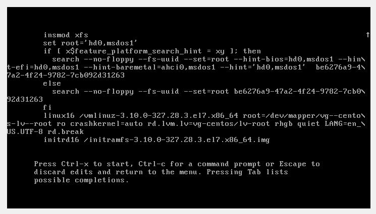

# **Домашнее задание №4: Загрузка системы:**


## Работа с загрузчиком

-  Попасть в систему без пароля несколькими способами
-  Установить систему с LVM, после чего переименовать VG
-  Добавить модуль в initrd


## **Ход выполнения:**

- **Попасть в систему без пароля несколькими способами:**

*При выборе ядра для загрузки нажимаем **"E"**, попадаем в окно, где можем менять параметры загрузки:*

### Способ 1. init=/bin/bash

 В конце строки начинающейся с **linux16** добавляем **init=/bin/bash**и нажимаем **сtrl-x** для
загрузки в систему.

Видим, что /bin/bash имеет PID=1


**1**

**2**

**3**

*Корневая файловая система монтируется в режиме Read-Only. Для перемонтирования ее в
режим Read-Write можно воспользоваться командой:*
```
    mount -o remount,rw /
```
*Или же можно заменить в параметрах загрузки **ro** - *read only* на **rw** - *read-write*


### Способ 2. rd.break
В конце строки начинающейся с **linux16** добавляем **rd.break** и нажимаем **сtrl-x** для
загрузки в систему.
Попадаем в **emergency mode**. Корневая файловая система смонтирована в режиме **Read-Only**. 


**1**

**2**

Для замены пароля администратора:
```
chroot /sysroot
mount -o remount,rw /sysroot
passwd root
touch /.autorelabel
```
**.autorelabel** сообщает **SELinux** о том,чтл необходимо запустить в **initrd** процесса **restorecon**(восстановление контекста) при следующей перезагрузке.

Перезагружаемся и заходим в систему с новым паролем. 

### Способ 3. rw init=/sysroot/bin/sh
В строке начинающейся с **linux16** заменяем **ro** на **rw init=/sysroot/bin/sh** и нажимаем **сtrl-x**
для загрузки в систему.
Файловая система уже смонтирована в режим **Read-Write**


**1**


## Установить систему с LVM, после чего переименовать VG

Cмотрим текущее состояние системы и переименовываем VG:


Правим [/etc/fstab](files/fstab), [/etc/default/grub](files/grub), [/boot/grub2/grub.cfg](files/grub.cfg) 

Меняем название на новое. 
Пересоздаем **initrd image**, чтобы он знал новое название Volume Group


Перегружаемся и проверяем:


### 3. Добавляем модуль в initrd

Создаем директорию для скриптов:
```
mkdir /usr/lib/dracut/modules.d/01test 
cd /usr/lib/dracut/modules.d/01test
```

Скачиваем скрипты:
```
wget -O module-setup.sh https://gist.githubusercontent.com/lalbrekht/e51b2580b47bb5a150bd1a002f16ae85/raw/80060b7b300e193c187bbcda4d8fdf0e1c066af9/gistfile1.txt
wget -O test.sh https://gist.githubusercontent.com/lalbrekht/ac45d7a6c6856baea348e64fac43faf0/raw/69598efd5c603df310097b52019dc979e2cb342d/gistfile1.txt
```


Пересобираем образ **initrd**:

```
dracut -f -v
```

или так:

```
mkinitrd -f -v /boot/initramfs-$(uname -r).img $(uname -r)
```

Проверяем

```
lsinitrd -m /boot/initramfs-$(uname -r).img | grep test
```


Перегружаемся и меняем параметры загрузки, убирая  **rghb** и **quiet**:


Результат:


