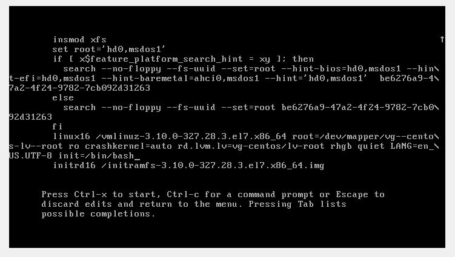
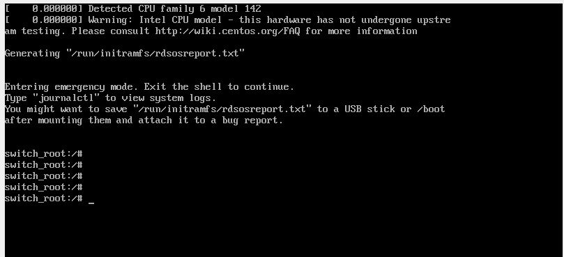

# **Домашнее задание №4: Загрузка системы:**


## Работа с загрузчиком

-  Попасть в систему без пароля несколькими способами
-  Установить систему с LVM, после чего переименовать VG
-  Добавить модуль в initrd


## **Ход выполнения:**

- **Попасть в систему без пароля несколькими способами:**

*При выборе ядра для загрузки нажимаем **"E"**, попадаем в окно, где можем менять параметры загрузки:*

### Способ 1. init=/bin/sh

 В конце строки начинающейся с **linux** добавляем **init=/bin/sh** или **init=/bin/bash**и нажимаем **сtrl-x** для
загрузки в систему


**1**

**2**

**3**

*Корневая файловая система монтируется в режиме Read-Only. Для перемонтирования ее в
режим Read-Write можно воспользоваться командой:*
```
    mount -o remount,rw /
```
*Или же можно заменить в параметрах загрузки **ro** - *read only* на **rw** - *read-write*

*Способы с **rd.break** и **rw init=/sysroot/bin/sh** в **Linux Mint** не работают

### Способ 2. systemd.unit=rescue.target
В конце строки начинающейся с **linux** добавляем **systemd.unit=rescue.target** и нажимаем **сtrl-x** для
загрузки в систему.





### Способ 3. systemd.unit=emergency.target
В конце строки начинающейся с **linux** добавляем **systemd.unit=emergency.target** и нажимаем **сtrl-x** для
загрузки в систему.


