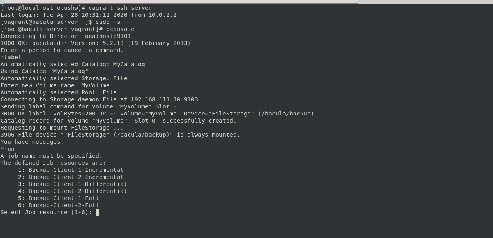
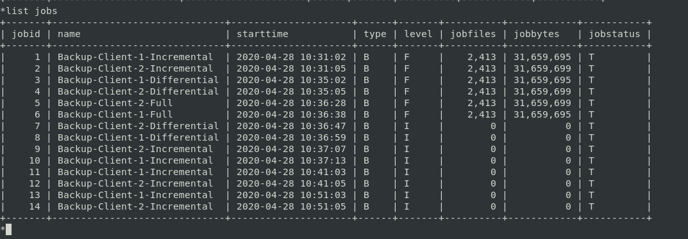
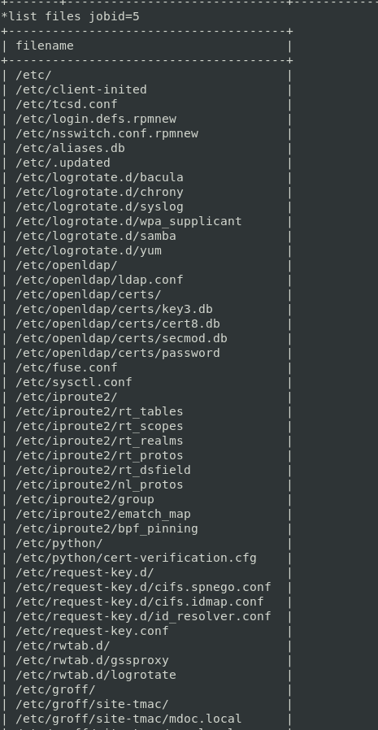
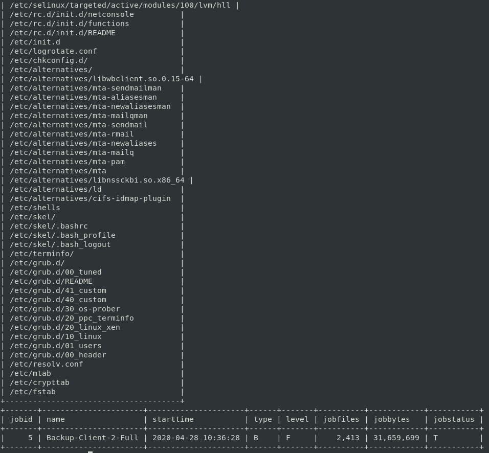

# **Домашнее задание №12: Резервное копирование **

## **Задание:**

Настроить стенд Vagrant с двумя виртуальными машинами server и client.

Настроить политику бэкапа директории /etc с клиента:
1) Полный бэкап - раз в день
2) Инкрементальный - каждые 10 минут
3) Дифференциальный - каждые 30 минут

Запустить систему на два часа. Для сдачи ДЗ приложить list jobs, list files jobid=id
и сами конфиги bacula-*

## **Выолнено:**

-  Запускаем [Vagrantfile](./Vagrantfile)

-  Зазодим на **server**

-  В консоли сервера выполняем:

**bconsole**

**list jobs**

**list files jobid=< id >**

Материалы для выполнения ДЗ:

[bacula-vagrant](https://github.com/haf/vagrant-bacula)

[Развертывание Bacula в малом офисе](https://antiskleroz.pp.ua/it/bacula)

[Bacula_configuration_video_1](https://www.youtube.com/watch?v=yNqRukupEXA)

[Bacula_configuration_video_2](https://www.youtube.com/watch?v=xbWB-bmT53Q&t=345s)

